# Conversation Intelligence using Artifical Intelligence (AI) / Machine Learning(ML) on AWS

> Jump to [deployment steps](#2-steps-to-deploy)

## 1. Overview

Businesses and industries often need to provide customer help, before a purchase of your product or service, during an
existing customer support instance, or throughout their core workflow. For example, a healthcare company may want to
engage users on a weight loss program or a fintech company might want to verify identity information or explain loan
application steps - customer interaction happens in many ways. The key is being ready to help your customers when and
how they need it. As a business, you may need to ensure few things including,

- **Understanding your customer well and their journey** - where is your customer coming from, why are they here and
  what
  is
  the best way to solve their problems.
- **Understanding outcome and business impact** – how well you served them, how brief contacts were required to solve
  the
  issue, how much was the ROI for your business, how much future wallet would it bring.
- **Understanding the opportunities** - how do we use all the data to continuously improve customer experience and
  margins.
- **Understanding compliance needs** – Are there certain regulations that we need to adhere to? GDPR? HIPAA?

Many organizations currently rely on a manual quality control process for customer interactions. This involves randomly
sampling a limited number of conversations for analysis. For regulated industries like healthcare and fintech, more
rigorous analysis of customer conversations may be required for conformity and protocol adherence. Additionally, there
is often a failure to quickly identify emerging themes and training opportunities across
conversations.

Organizations interact with customers across multiple channels - phone, video, chat etc. A robust "conversation
intelligence" solution that combines AI/ML technologies is needed to enable processing of entire customer conversations,
regardless of channel.

This sample solution leverages Amazon Web Services (AWS) AI/ML services and open source models to extract insights from
audio calls, chat
conversations and could potentially do video as well. Key capabilities include:

- Sentiment analysis
- Identifying call drivers and emerging trends
- Agent coaching opportunities
- Compliance monitoring and adherence

By processing all customer interactions with AI/ML, this sample solution provides comprehensive coverage and actionable
insights. The open source foundations and AWS services make it easy to configure for your needs.

### 1.1 About this solution

At AWS, there are many ways in which we can build conversation intelligence. This project is inspired by our
other sample solutions that are listed below,

- Post Call Analytics using Amazon Transcribe - https://github.com/aws-samples/amazon-transcribe-post-call-analytics
- Live Call Analytics - https://github.com/aws-samples/amazon-transcribe-live-call-analytics

This sample solution is for those organizations that need to use open-source or custom models that are specifically
built for them. It does most of the heavy lifting associated with providing an end-to-end workflow that can process
call recordings, chat transcripts from your existing workflow. It provides actionable insights to spot emerging trends,
identify agent coaching opportunities, and assess the general sentiment of calls.

### 1.2 Architecture

This sample is modular and can be plugged in to your existing analytics workflows to analyze conversations. Refer the
architecture below.

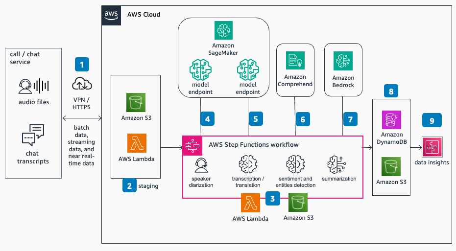

The solution supports MP3, WAV and can easily customized to support other audio types. If you have videos, by using
Amazon Elemental MediaConvert, we can extract audio and process audio through this solution. Please take a look at the
process flow below,

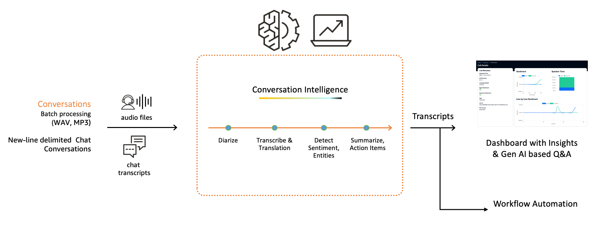

#### 1.2.1 Speaker Diarization

The first step is to identify speakers. To improve accuracy, and identify speakers on the conversation, we
need to first perform diarization. Speaker Diarization is the process of the model helping you understand, "Who spoke
when?". We can use models like Pyannote Audio or Nvidia’s NeMo to diarize input audio files. We use Pyannote.audio,
which is an open-source toolkit written in Python for speaker diarization. This is based on PyTorch machine learning
framework, and it comes with state-of-the-art pretrained models and pipelines. It can be further fine-tuned to your own
data for even better performance.

#### 1.2.2 Splitting Audio Files

After diarization, we split original input file to audio clips based on speaker diarization data. The model then takes
audio input and gives text output.

#### 1.2.3 Transcription and Translation

In this solution, we use Faster-Whisper with CTranslate2. faster-whisper is a reimplementation of Whisper model using
CTranslate2, which is a fast inference engine for Transformer models. This implementation claims to have upto 4 times
faster performance than whisper for the same accuracy while using less memory.

> This solution is model agnostic, and you can use any model of your choice by changing container scripts
> under ```ml_stack``` with minimal code change.

After transcription is over, we do translation using same whisper model and give audio as input.

#### 1.2.4 Entities and Sentiment Detection

The solution use Amazon Comprehend, natural language processing / NLP service that uses machine learning to uncover
information in unstructured data. We extract sentiment, entities using Comprehend. We can easily extend this to detect
PII and mask if need be

#### 1.2.5 Generative AI to summarize,generate action items, checking conformity and more

Finally, using generated transcripts, the solution use Generative AI models such as ```Anthropic Claude v2```
on ```Amazon Bedrock``` to summarize the conversation. We’ve built various prompts to extract actions, issues, call back
and other KPIs as needed. For example, you can build a prompt to check if the agent greeted customers properly. And
ended call asking for feedback. And can also get in to complex needs like extracting answers of security question and
comparing with the database to ensure the caller was legitimate.

## 2. Steps to deploy

### 2.1 Setting up cloud environment to build models and web application

#### Option1: Cloud9 Based Setup
Note that the models used in this sample solution need significant storage and network. We recommend to use AWS Cloud9 IDE to build and deploy. Also, since this build ML model containers and deploy to Amazon SageMaker Inference Endpoints, its better to run these on Cloud9. Follow instructions from [Setting up Cloud9](https://docs.aws.amazon.com/cloud9/latest/user-guide/setup-express.html) and make sure you have enough storage to build models (recommended to have 100GB). After provisioning, ensure you increased disk capacity to 100 GB following the steps here [Resize Environment Storage](https://docs.aws.amazon.com/cloud9/latest/user-guide/move-environment.html#move-environment-resize)

#### Option2: EC2 Based Setup
Note that the models used in this sample solution need significant storage and network. We recommend to use an EC2 Instance (m5.large with 200GB GP3 storage) to build and deploy. Install the necessary components using the following commands
```
sudo yum install docker nodejs git
sudo npm install -g aws-cdk
curl https://bootstrap.pypa.io/get-pip.py -o get-pip.py
python3 get-pip.py
sudo systemctl start docker
```  
Ensure the user has permissions to access the docker service.

### 2.2 Setting up the project

This project is set up like a standard Python based CDK project. The initialization process also creates a virtualenv
within this project, stored under the .venv directory. To create the virtualenv it assumes that there is a `python3`
executable in your path with access to the `venv` package. If for any reason the automatic creation of the virtualenv
fails, you can create the virtualenv manually once the init process completes.

To manually create a virtualenv on MacOS and Linux:

```
python3 -m venv .venv
```

After the init process completes and the virtualenv is created, you can use the following step to activate your
virtualenv.

```
source .venv/bin/activate
```

If you are a Windows platform, you would activate the virtualenv like this:

```
% .venv\Scripts\activate.bat
```

Once the virtualenv is activated, you can install the required dependencies.

```
pip install -r requirements.txt
```

To add additional dependencies, for example other CDK libraries, just add to your requirements.txt file and rerun
the `pip install -r requirements.txt` command.

### 2.3 Setting up AWS environment

We need to configure access credentials in the cloud environment before deploying the CDK stack. For that,
run ```aws configure``` command for the first time to confiture account.

```
aws configure
```

Then ensure you have configured the right region and modified [```cfg.py```](cfg.py). It's ideal to pick a region that
has access to Amazon Bedrock

```
REGION = "us-west-2"
```

### 2.4 Building web application

The web application based on [Cloudscape](https://cloudscape.design/). The source code is
within [```web_app/ci-portal```](web_app/ci-portal). We need to install and build using npm.

```
cd web_app/ci-portal
npm install
npm run build
```

### 2.5 Enable Amazon Bedrock Model Access

Amazon Bedrock users need to request access to models before they are available for use. Model access can be managed
only in the Amazon Bedrock console. To request access to a models, select the Model access link in the left side
navigation panel in the Amazon Bedrock console.
> As a prerequisite, you need
> to [add model access](https://docs.aws.amazon.com/bedrock/latest/userguide/model-access.html) Amazon Bedrock in the
> region where you are deploying this solution.

### 2.6 Configure HuggingFace Access token in ```cfg.py```

We are using ```pyannote/speaker-diarization-3.0```and ```pyannote/segmentation-3.0``` which are pretrained models from
HuggingFace. Please ensure you add your [HuggingFace Security Token](https://huggingface.co/docs/hub/security-tokens)
to [```cfg.py```](cfg.py), or else, the solution will fail while executing.

> To create access token, go to your settings in HuggingFace portal, then click on
> the [Access Tokens tab](https://huggingface.co/settings/tokens). Also, make sure token has access to both these models
> by going to the respective models
> page [pyannote/speaker-diarization-3.0](https://huggingface.co/pyannote/speaker-diarization-3.0)
> and [pyannote/segmentation-3.0](https://huggingface.co/pyannote/segmentation-3.0) to check if you can access using
> token.

```
HF_TOKEN = 'hf_xxxx'
```

### 2.7 Bootstrap and Deploy the stacks

If you are setting up CDK environment for the first time in the region, then run

```
cdk bootstrap
```

Finally, you can run the following command to deploy all stacks.

```
cdk deploy --all
```

You can optionally do ```cdk deploy --all --require-approval never``` flag which will skip confirming any changes to the
stack deployment and will continue with deployment.

Congratulations! 🎉 You have completed all the steps for setting up conversation intelligence sample solution using AIML
on AWS.

_The CDK stack will deploy two ```g5.2xlarge``` instances for SageMaker Inference Endpoints which will be running all
the time. We recommend to adjust application scaling policy in [diarization_stack](ml_stack/cdk/diarization_stack.py)
and [transcription_stack](ml_stack/cdk/transcription_stack.py) based on your usage pattern._

### 2.8 Other useful CDK commands

* `cdk ls`          list all stacks in the app
* `cdk synth`       emits the synthesized CloudFormation template
* `cdk deploy`      deploy this stack to your default AWS account/region
* `cdk diff`        compare deployed stack with current state
* `cdk docs`        open CDK documentation

### 2.9 CDK Stack Details

There are three stakes in this solution

1. ```ml_stack``` - Stack with speaker diarization and transcription models and its respective resources. The stack
   use ```Amazon SageMaker``` to deploy inference endpoints
2. ```server``` - Stack with all the functions and workflows using ```AWS Lambda``` and ```AWS Step Functions```
3. ```web_app``` - Stack with the dashboard application and APIs
   using ```Amazon API Gateway```, ```AWS Lambda```, ```AWS Amplify```

## 3. Usage

1. Check for ```cdk``` output messages for Conversation Bucket name, and CloudFront URL
2. Go to S3, and open S3 bucket named ```ci-process-conversationsxxxxxx-xxx``` as mentioned in the CDK output
3. Create a prefix named ```input``` and upload sample audio files inside the prefix. If you don't have samples, you
   shall use files
   from https://github.com/aws-samples/amazon-transcribe-post-call-analytics/tree/develop/pca-samples/src/samples
4. Once audio files are upload, you shall check workflow status by opening Step Function ```ciworkflowxxxx```
5. Then, login to the "Conversation Intelligence" dashboard using the CDN URL.
6. Create a user and login to the dashboard.
7. While creating user, give your email and password, and you will receive verification code. Enter the verification
   code to successfully register.
8. Once you login, there are three major modules, 1. Conversation List, 2. Call Details, and 3. Workflows
   Administration.

### 3.1 Conversation List

After login, you will land in to the conversation list page. This is a paginated list of all conversations that are
processed by the solution.
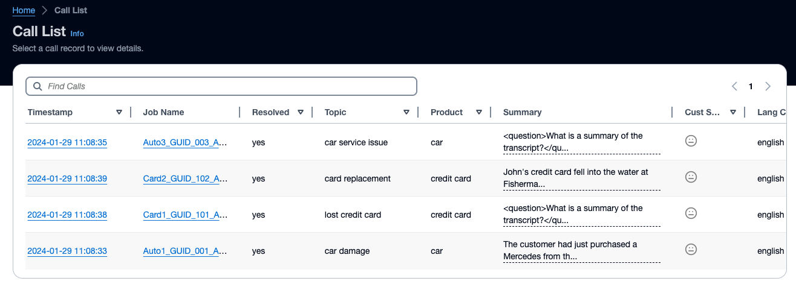

You also have advanced search/filter feature that allows users to filter list by job name (audio file), language code,
duration and other criteria as shown.

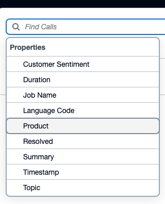

You can click Job name to get into the conversation details page.

### 3.2 Conversation Details

Conversation Details page has multiple sections 1. Call Metadata, 2. Sentiment and Speaker Insights, 3. Entities, 4.
Insights by Generative AI, 5. Analysis powered by Generative AI, and 5. Turn by turn transcript and translated
transcript

#### 3.2.1 Conversation Metadata

Call metadata section has file and process metadata including uploaded time, call duration, language, customer and agent
sentiment and file format
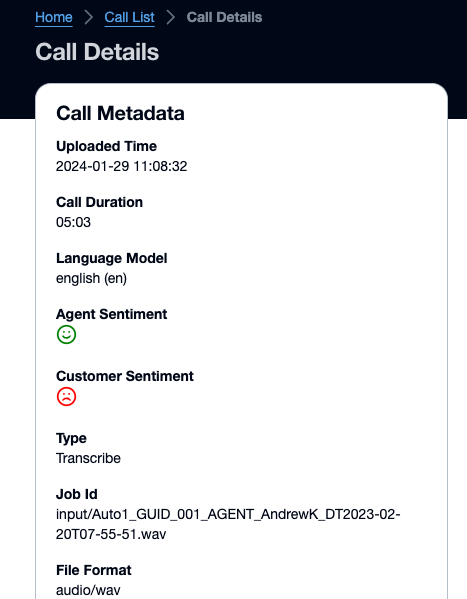

#### 3.2.2 Sentiment and Speaker Insights

Sentiment and Speaker Insights section has few charts displaying three insights

1. Sentiment progress across four quarters of the call
2. Speaker time, total time various speakers conversed across the call
3. Turn by turn sentiment
   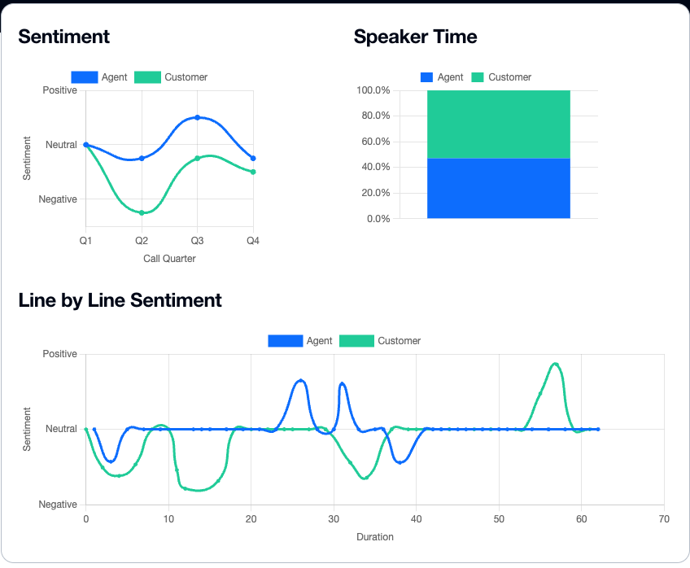

#### 3.2.3 Entities

This section displays all the entities detected by Amazon Comprehend throughout the call. This is grouped in to various
categories and displayed
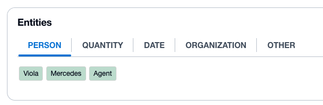

#### 3.2.4 Insights by Generative AI

This section displays summary, action item, topic, product, resolution, politeness and call back which are extracted by
Generative AI. The transcript is given to the LLM and based on the defined prompts, the values are extracted. These
prompts are customizable under "Workflows Administration" module

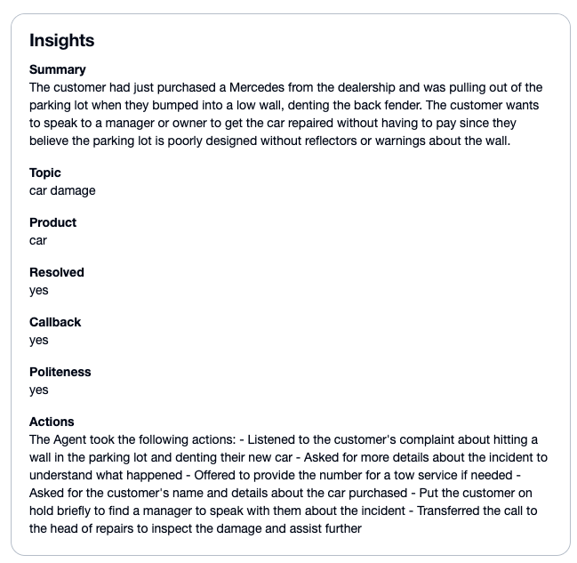

#### 3.2.5 Analysis powered by Generative AI

This section allows you to run ad-hoc prompts to extract additional insights by deep diving into the selected
conversation. It also lists additional workflow prompts that can extract insights based on specific functions (e.g.
sales, product support). These prompts help obtain targeted data and insights.

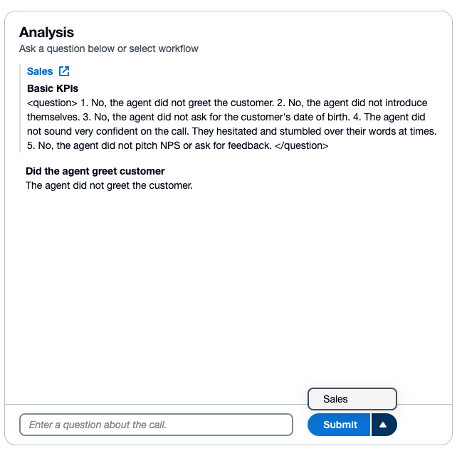

#### 3.2.6 Transcript / Translated Transcript with Audio Player

This section displays entire conversation as turn-by-turn message along with sentiment detected for each turn. This
section also has an option to switch to translated version if the original language is not English. It also has audio
player widget to play entire audio which also highlights the conversation turn based on time cue.

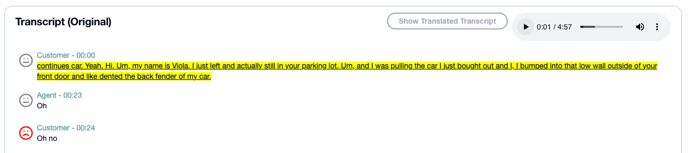

### 3.3 Workflows Administration

You can open Workflows administration by choosing the option from navigation bar.

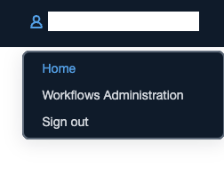

It will have ```Default Workflow``` that contains all the prompts that are required to extract data needed to
give [```Insights```](#324-insights-by-generative-ai) about the call. These prompts are customizable by selecting
the ```Default Workflow``` card. You can edit or add new workflows. Please note that you won't be able to delete Default
Workflows, but you can edit prompts inside.

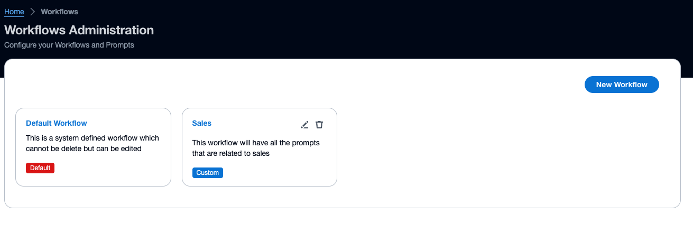

#### 3.3.1 Editing Prompts within Workflows

Each workflow can have upto 10 prompts (soft limit that can be modified in the code). By default, the solution
leverages ```Anthropic Claude v2```
using ```Amazon Bedrock``` APIs. This can be entirely modified easily in the respective lambdas.

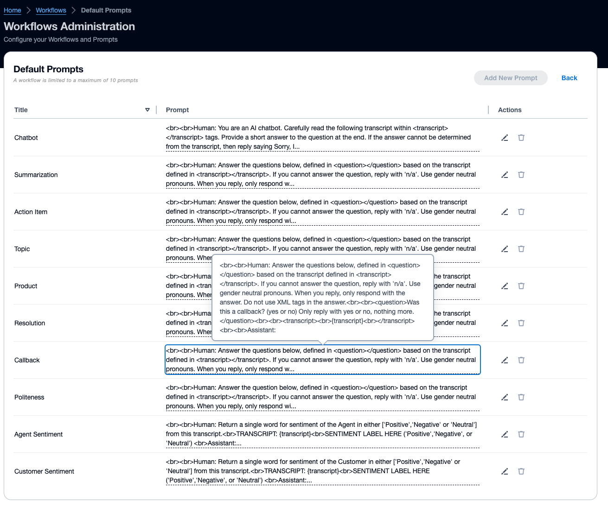

Upon clicking edit icon next to each prompt, you can modify the prompt as shown in the image below. The prompts have to
be in specific
formats that the chosen Large Language Model (LLM) understands, or it will throw error during execution.

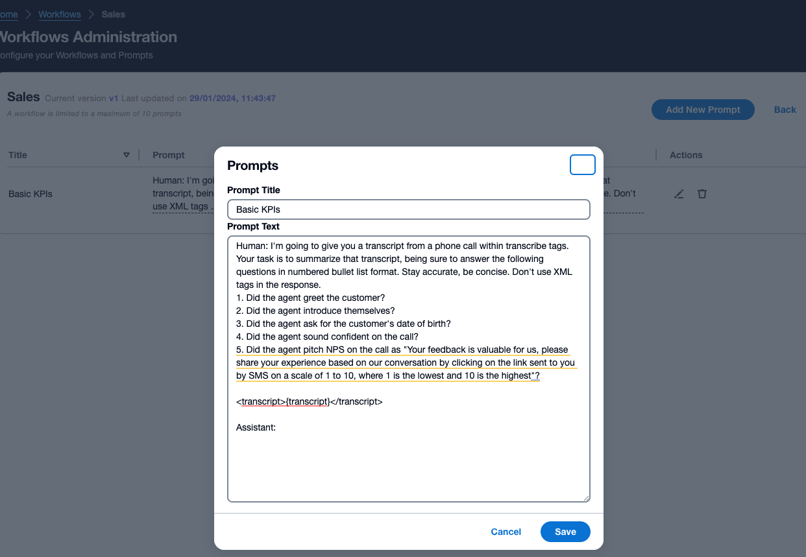

# 4. What's next?

We are working on code enhancements and additional features to make speakers configurable.

# 5. Conclusion

This conversation intelligence using AIML offers a scalable, and cost-effective approach to extract summary and insights
from agent to customer conversations. It uses Amazon SageMaker, Amazon Bedrock, Amazon Comprehend and other AIML
services along with a dashboard that helps contact center quality teams. This solution is published as open source and
expect it to be a starting point of your own solution. This can be plugged in to your existing flows, and can be
customized to fit your specific needs. Help us make this sample solution better by contributing back with improvements
and fixes via GitHub pull requests. For expert
assistance, [AWS Professional Services](https://aws.amazon.com/professional-services/) and
other [AWS Partners](https://aws.amazon.com/partners/) are here to help.

## 6. Clean Up

Congratulations! :tada: You have completed all the steps for setting up your conversation intelligence sample solution
using AIML on AWS.

**To make sure you are not charged for any unwanted services, you can clean up by deleting the stack created in
the _[Deploy](#2-steps-to-deploy)_ section and its resources.**

When you’re finished experimenting with this sample solution, clean up your resources by using the AWS CloudFormation
console to delete the ```ci-*``` stacks that you deployed. This deletes resources that were created by deploying the
solution. The recording S3 buckets, the DynamoDB table and CloudWatch Log groups are retained after the stack is deleted
to avoid deleting your data.

Or, for deleting this stack, run following cdk command.

```
$ cdk destroy --all
```

[(Back to top)](#1-overview)

## 7. Contributing

Your contributions are always welcome! Please have a look at the [contribution guidelines](CONTRIBUTING.md) first. :
tada:

[(Back to top)](#1-overview)

## 8. Security

See [CONTRIBUTING](CONTRIBUTING.md#security-issue-notifications) for more information.

[(Back to top)](#1-overview)

## 9. License Summary

This sample code is made available under the MIT-0 license. See the [LICENSE](LICENSE) file.

[(Back to top)](#1-overview)
  